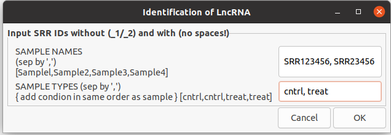
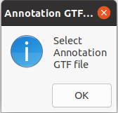
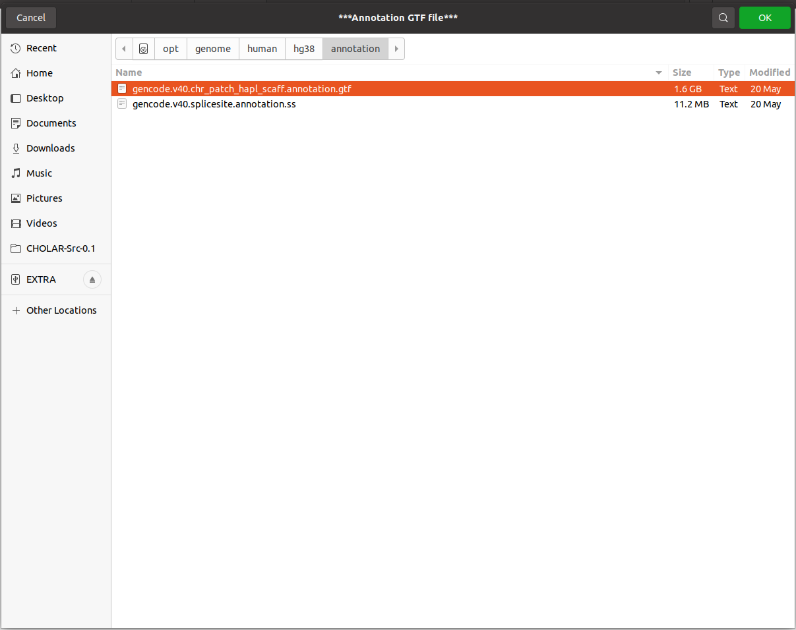

# CHOLAR

**CHOLAR** short for **CH**aracterization **O**f **L**ncRNA from r**A**w **R**eads).
## Table of contents


## Description

## What does CHOLAR do?

## Installation

### For macOS users

`brew` is a pre-requistic. For information on `brew` visit https://brew.sh/

Download the zip file for CHOLAR from [here][zip] *or*

Download the tar file for CHOLAR from [here][tar]


After download unzip the file using:
```sh
unzip 
```


### For Ubuntu/CentOS users

## Configuration

## Using CHOLAR

1. Execute the configure file on LINUX/UNIX system using terminal:

```sh
bash configure.sh
```

This will prompt to give password. Enter it and let the script run.


2. Then execute CHOLOAR GUI file using:

```sh
bash CHOLAR_GUI.sh
```


 2.1 This will pop up a window to input sample names in the box and sample condition separated by comma.



2.2 Then the Annotation file selection will appear (if it appears daunting, just press ok in both dialog box).




## Troubleshoot

## Authors

**CHOLAR** is developed by Haneesh J, Anubha Dey and Manjari Kiran (*Department of Systems and Computational Biology, School of Life Sciences, University of Hyderabad, India*).

## How to cite CHOLAR

If you use **CHOLAR** in your publications, you can cite the package as follows:

` CHOLAR: Characterization of LncRNA from raw reads. `

or in BiBTex:


## LICENSE

See the [LICENSE][LIC] file for license rights and limitations.

## Acknowledgement

This work is supported by SERB Startup Grant (SRG/2020/002146) from Department of Science and Technology (DST), India.


[zip]: <https://github.com/schosio/CHOLAR/releases/download/v0.1/CHOLAR-Src-0.1.zip>
[tar]: <https://github.com/schosio/CHOLAR/releases/download/v0.1/CHOLAR-Src-0.1.tar.gz>
[LIC]: <https://github.com/schosio/CHOLAR/blob/main/LICENSE>